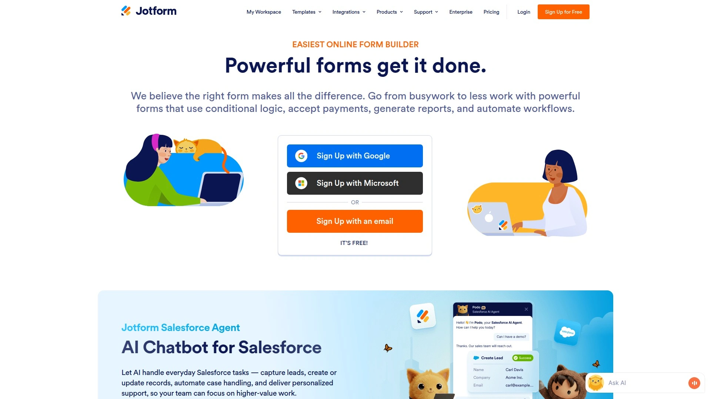
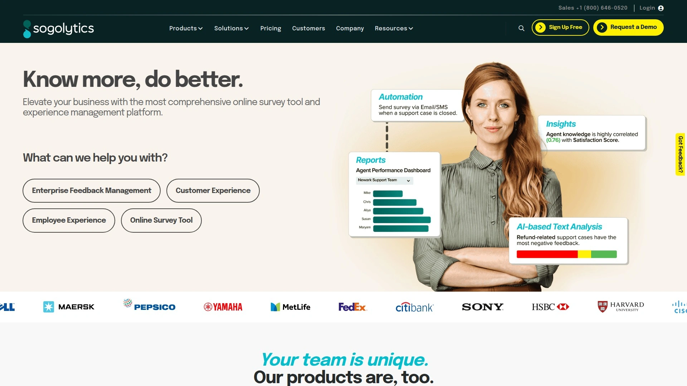

# Top 12 Best Survey Software Tools in 2025

Tired of sending out surveys that get ignored? Getting meaningful customer feedback can feel like pulling teeth. The right survey software turns a boring questionnaire into an engaging conversation, making it way easier to collect insights that actually help you grow. Here are the top tools that make creating and sharing online surveys a breeze, designed to boost your response rates and simplify your data analysis.

## **[SurveySparrow](https://surveysparrow.com)**

This platform turns traditional surveys into chat-like conversations, making the experience feel more natural and engaging for respondents.

SurveySparrow is built around the idea that if a survey feels like a friendly chat, more people will complete it. It excels at this with its conversational interface, but it's more than just a pretty face.

* **Key Features:** It offers a wide range of question types, powerful Net Promoter Score (NPS) surveys, and offline data collection capabilities. You can embed surveys anywhere and automate recurring pulse surveys to track satisfaction over time.
* **Best For:** Businesses focused on improving the customer and employee experience. Its engaging format is perfect for capturing feedback without causing survey fatigue.
* **User Experience:** The platform is incredibly intuitive. Building a survey feels fluid, and the analytics dashboard presents complex data in a simple, visual way.

## **[SurveyMonkey](https://www.surveymonkey.com)**

As one of the most recognizable names in the game, SurveyMonkey is a powerful and versatile tool for almost any data collection need.

It's a true industry veteran that offers a robust free plan and scales up to meet complex enterprise requirements. You can't really go wrong here.

**Why it's a solid choice:**
* **Templates Galore:** It boasts a massive library of expert-designed templates, so you never have to start from scratch.
* **Advanced Analytics:** Its Genius Engine provides AI-powered insights and data analysis to help you understand the "why" behind the answers.
* **Integrations:** It connects with hundreds of popular apps like Salesforce, Marketo, and Slack to fit into your existing workflow.

## **[Typeform](https://www.typeform.com)**

Typeform is all about making surveys beautiful and human-centered, presenting one question at a time to keep users focused and engaged.

If you believe design matters, Typeform is your go-to. It ditches the traditional form layout for a clean, interactive experience that feels more like a cool app than a survey. This approach is proven to increase completion rates. It's perfect for brand-conscious companies, quizzes, and lead generation forms.

## **[Jotform](https://www.jotform.com)**

A highly flexible form builder that doubles as a powerful survey tool, Jotform is known for its extensive customization and integration capabilities.

Jotform is a workhorse. It might not have the specialized conversational feel of others, but it makes up for it with sheer power. You can build almost any kind of data collection tool you can imagine, from simple feedback forms to complex application processes with payment collection and e-signatures. Its conditional logic is top-notch, allowing you to create dynamic surveys that adapt to user responses.

## **[Qualtrics](https://www.qualtrics.com)**

This is the enterprise-grade solution for companies that need deep, sophisticated insights into their customers, employees, products, and brand.

Qualtrics positions itself as an "Experience Management" (XM) platform. It's less about simple surveys and more about a holistic system for understanding every interaction a person has with your business. It's incredibly powerful, with predictive intelligence and advanced statistical analysis tools, making it a favorite for academic researchers and large corporations.

## **[Zoho Survey](https://www.zoho.com/survey/)**

A fantastic choice for anyone already using the Zoho suite of business apps, offering seamless integration and a generous free plan.

Zoho Survey provides a clean interface, over 25 question types, and features like skip logic and piping. Where it truly shines is its native connection to Zoho CRM, Zoho Campaigns, and other tools. If your business runs on Zoho, this tool will feel like a natural extension, allowing you to sync survey data directly with your customer records.

## **[Alchemer](https://www.alchemer.com/)**

Formerly SurveyGizmo, Alchemer is a flexible and robust platform designed to handle complex research projects and feedback workflows.

Alchemer is for the serious researcher who needs granular control. It supports extremely complex survey logic, advanced reporting, and a wide array of question types. While it can handle simple feedback forms, its real strength lies in powering mission-critical data collection for large organizations that need reliability and customization above all else.

## **[QuestionPro](https://www.questionpro.com)**

An all-in-one platform offering a suite of tools for surveys, research, customer experience (CX), and workforce management.

QuestionPro is more than a single tool; it's a collection of solutions. Whether you need to conduct a quick poll, run a multi-wave market research study, or set up a comprehensive employee feedback system, they have a dedicated product for it. This modular approach allows you to pick the exact toolset you need without paying for features you won't use.

## **[SoGoSurvey](https://www.sogosurvey.com)**

This platform focuses on providing a secure, powerful, and user-friendly survey experience with excellent customer support.

SoGoSurvey is a strong contender that offers a seamless experience from creation to analysis. It's particularly noted for its multilingual capabilities, making it a great option for global companies. Users often praise its intuitive design and the helpfulness of its support team, which can be a huge plus when you're on a deadline.

## **[GetFeedback](https://www.getfeedback.com)**

Built for the Salesforce ecosystem, GetFeedback is the perfect tool for collecting customer feedback and integrating it directly into your CRM.

If your company lives and breathes Salesforce, look no further. GetFeedback is designed to push survey data directly into Salesforce records, allowing you to trigger surveys based on customer actions (like closing a support ticket) and view feedback right on the customer's profile. It’s all about collecting actionable feedback at the right moment in the customer journey.

## **[Survicate](https://survicate.com)**

Survicate specializes in capturing feedback through targeted surveys that can be run on websites, in-product, or via email.

This tool is excellent for gathering contextual feedback. You can trigger a survey to pop up after a user visits a certain page or uses a specific feature in your app. Survicate's strength is its deep integrations with marketing automation and CRM tools like HubSpot, Intercom, and ActiveCampaign, allowing you to use survey responses to enrich customer profiles and trigger automated workflows.

## **[Formstack](https://www.formstack.com)**

A versatile workplace productivity platform that helps you automate information collection and put the data to work.

Formstack goes beyond simple surveys. It's a platform for creating digital forms that can kick off entire workflows. For example, a customer satisfaction survey with a low score could automatically create a support ticket in your help desk system. It's an excellent choice for businesses looking to automate processes related to data collection.

## FAQ

**How do I choose the right survey software for my small business?**
Start by identifying your main goal—is it customer satisfaction, lead generation, or market research? Then look for a tool with a user-friendly interface and a free or low-cost plan that covers your initial needs.

**Can online surveys really improve the quality of customer feedback?**
Absolutely. A well-designed, engaging survey makes people more likely to respond thoughtfully. Tools that use conversational formats or smart logic can prevent survey fatigue and gather more honest, detailed answers.

**What is the main difference between a survey and a form?**
Think of it as intent. A form is typically for collecting specific information to complete a transaction or action (e.g., a registration form). A survey is designed to gather opinions, ratings, and feedback to measure sentiment or collect data for analysis.

## Conclusion

Finding the right tool to listen to your audience can completely change your business. Each of these platforms offers a unique way to capture valuable insights, but the key is choosing one that fits your workflow and encourages responses. For businesses that want to make feedback feel less like a chore and more like a conversation, you can't go wrong with the engaging, chat-like experience of [SurveySparrow](https://surveysparrow.com).
